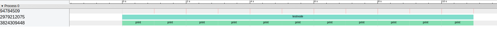
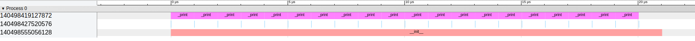

# test_benchmark

### ROS Node

Both the test_cpp and the test_py are simple ros2 nodes achieving a simple producer-consumer model by cpp and py in respect. The benchmark script in cpp or python is included in the header folder ([cpp](./test/test_cpp/include/test_cpp/Instrumentor.h) && [python](./test/test_py/test_py/benchmark.py))

### Benchmark (Instrumentor)

Benchmark can generate json configurations for visualizing multithreads in ros with the help of chrome://tracing. The idea comes from [The Cherno](https://www.youtube.com/watch?v=xlAH4dbMVnU&t=406s), a very famous youtuber teaching cpp. His cpp source code is converted into a python version in this respository.

It can convenient to use the tool by easily including or importing the source script and then declaring timers on suitable lines. It's not necessary to use it in ros.

### Demo

In terminal:
```
cd test
colcon build
source install/setup.bash
ros2 run test_cpp test_cpp #cpp node
ros2 launch test_py print.launch.py #python node
```

Load the cpp node result: [results.json](./test/results.json) into the chrome://tracing :


Load the python node result: [result.json](./test/result.json) into the chrome://tracing :

